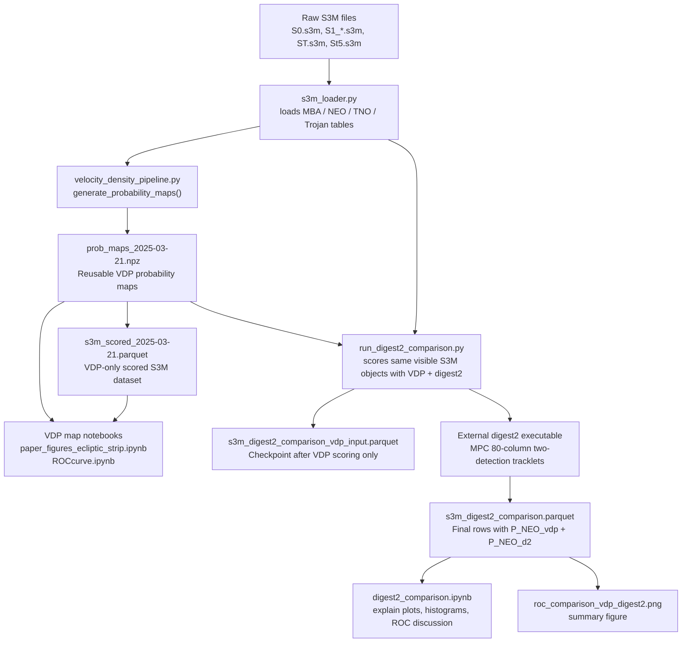

# VDP / digest2 Context Diagram

This is the short version of what to run first and what each artifact means.

## Big Picture



## What Each File Is

| File | What it is | Run first? |
|---|---|---|
| `neomod/s3m_loader.py` | Loads raw S3M population files into pandas DataFrames. | Used by scripts, not run directly. |
| `neomod/velocity_density_pipeline.py` | Main VDP library: builds maps, saves `.npz`, loads maps, scores objects. | Used by notebooks/scripts. |
| `neomod/download_prob_maps.ipynb` | Notebook that ran `vdp.generate_probability_maps(...)`. Despite the name, it generated the VDP map artifact. | Run only if `prob_maps_2025-03-21.npz` is missing or you want to rebuild maps. |
| `neomod/prob_maps_2025-03-21.npz` | Compact reusable VDP probability maps for 2025-03-21, opposition-centered 30 deg sky patch, mag 14-26. | Must exist before most later notebooks/scripts. |
| `neomod/s3m_scored_2025-03-21.parquet` | VDP-only scored S3M rows for ROC-style notebooks. | Generated after `.npz`; reused by `ROCcurve.ipynb`. |
| `neomod/run_digest2_comparison.py` | Standalone comparison pipeline: loads `.npz`, loads S3M, scores VDP, formats digest2 tracklets, runs digest2, saves final comparison parquet and ROC PNG. | Run before `digest2_comparison.ipynb` if final comparison parquet is missing/stale. |
| `neomod/s3m_digest2_comparison_vdp_input.parquet` | Intermediate checkpoint from `run_digest2_comparison.py`, after VDP scoring and before digest2 scores. | Usually do not run/open first. |
| `neomod/s3m_digest2_comparison.parquet` | Final digest2-vs-VDP dataset with `P_NEO_vdp` and `P_NEO_d2`. | Input to `digest2_comparison.ipynb`. |
| `neomod/digest2_comparison.ipynb` | Analysis/explanation notebook for the final comparison parquet. | Run after `run_digest2_comparison.py`. |
| `neomod/roc_comparison_vdp_digest2.png` | Output figure from `run_digest2_comparison.py`. | Produced automatically. |

## Run Order For Someone New

### If the generated files already exist

The current repo already has the key artifacts:

```text
neomod/prob_maps_2025-03-21.npz
neomod/s3m_scored_2025-03-21.parquet
neomod/s3m_digest2_comparison.parquet
neomod/s3m_digest2_comparison_vdp_input.parquet
neomod/roc_comparison_vdp_digest2.png
```

So the fastest path is:

```bash
cd /Users/devanshisingh/Downloads/research/NEO_probability/neomod
jupyter notebook digest2_comparison.ipynb
```

Open the notebook and read/run it. It uses:

```text
s3m_digest2_comparison.parquet
prob_maps_2025-03-21.npz
```

### If rebuilding from scratch

```bash
cd /Users/devanshisingh/Downloads/research/NEO_probability/neomod
```

1. Make the VDP maps:

```text
Run download_prob_maps.ipynb
```

This calls:

```python
vdp.generate_probability_maps(
    obstime_str="2025-03-21T00:00:00",
    output_path="prob_maps_2025-03-21.npz",
)
```

2. Optional VDP-only ROC dataset:

```text
Run the scoring cells in ROCcurve.ipynb if s3m_scored_2025-03-21.parquet is needed.
```

3. Full VDP vs digest2 comparison:

```bash
MPLCONFIGDIR=/private/tmp/mplconfig python run_digest2_comparison.py
```

This may take about an hour because digest2 is run in chunks.

4. Open the explanatory notebook:

```bash
jupyter notebook digest2_comparison.ipynb
```

## The Important Mental Model

The `.npz` file is not the final scored data. It is the reusable VDP lookup table:

```text
observed motion + magnitude -> P(NEO), P(MBA), P(TNO), P(Trojans)
```

The `.parquet` files are scored object tables. They are bigger row-by-row datasets used for ROC curves, histograms, and comparison plots.

So the dependency is:

```text
raw S3M files -> VDP map .npz -> scored parquet files -> analysis notebooks / figures
```

For the digest2 comparison specifically:

```text
raw S3M files + VDP .npz + external digest2 -> s3m_digest2_comparison.parquet -> digest2_comparison.ipynb
```

